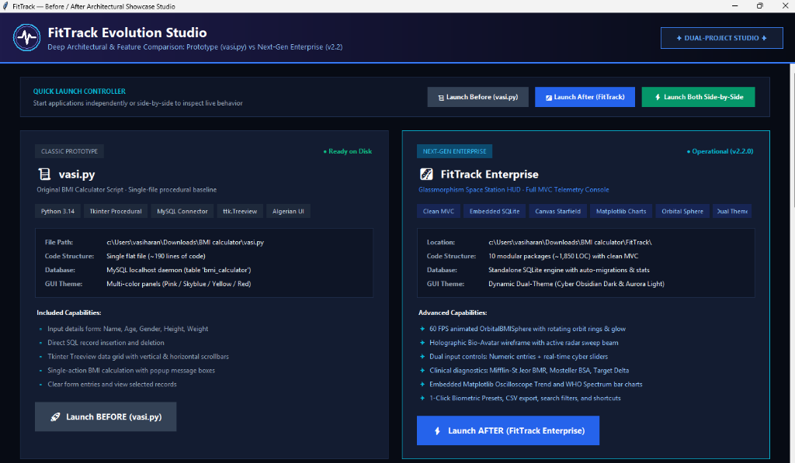
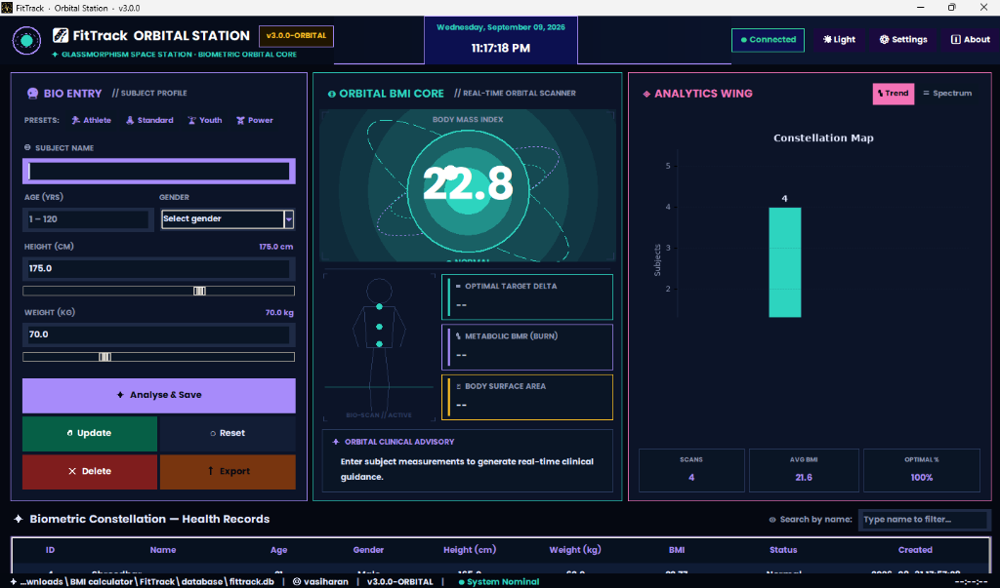
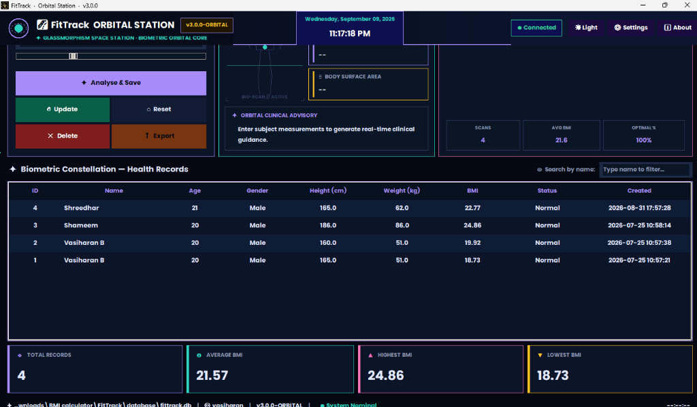
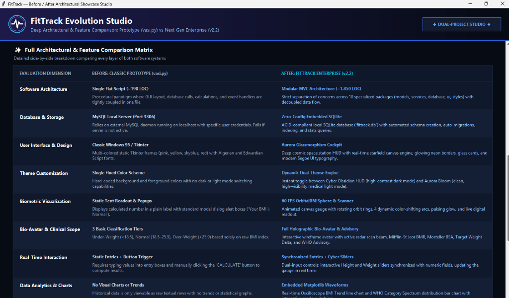
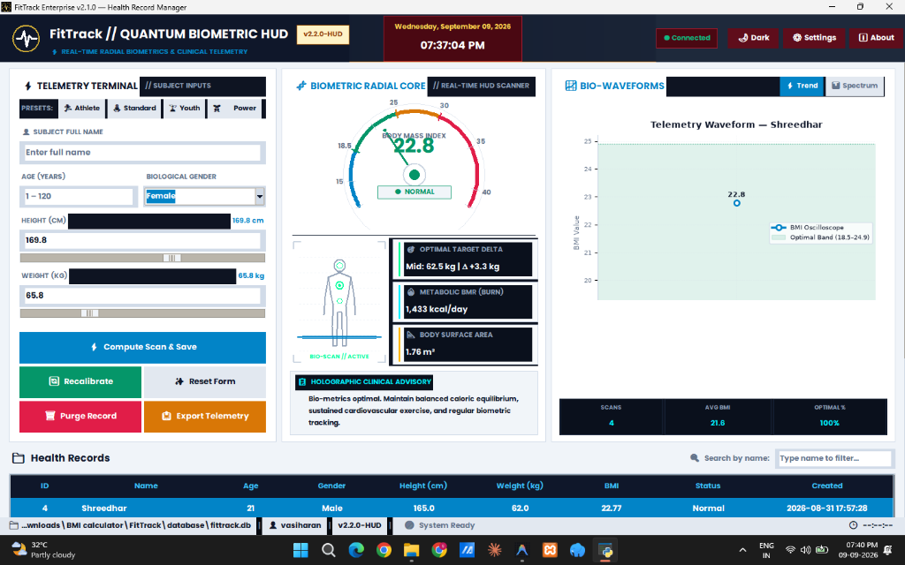
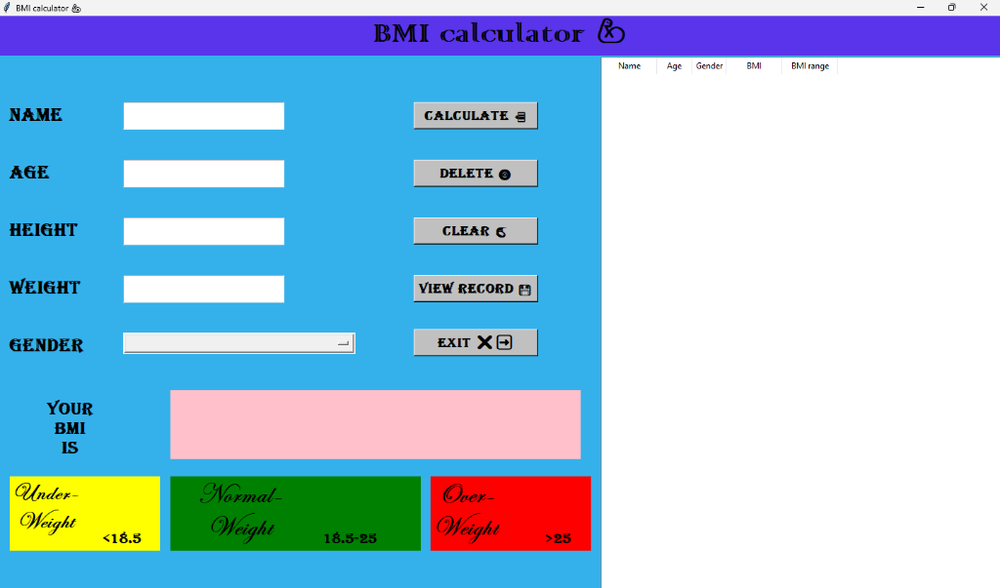

<div align="center">

# 🚀 FitTrack Enterprise // Quantum Biometric Cockpit & Evolution Studio

**From Classic Tkinter Prototype to Next-Generation Orbital Biometric Telemetry Console**

[](https://www.python.org/)
[](https://docs.python.org/3/library/tkinter.html)
[](https://www.sqlite.org/)
[](https://matplotlib.org/)
[](LICENSE)
[](https://github.com/)

[**Showcase Studio**](#-the-evolution-studio-showcasepy) •
[**Orbital Cockpit**](#-the-3-wing-biometric-cockpit-architecture) •
[**Comparison Matrix**](#-architectural--feature-comparison-matrix) •
[**UI Screenshots**](#-ui-gallery) •
[**Quick Start**](#-quick-start--installation) •
[**Keyboard Shortcuts**](#-keyboard-shortcuts)

<br/>

<p align="center">
  
</p>
<p align="center"><em>FitTrack Evolution Studio (showcase.py): Full-screen side-by-side comparison launcher and multi-app controller</em></p>

---

</div>

## 📖 Overview

**FitTrack** represents a full-spectrum software engineering and UI/UX evolution. This repository houses both ends of the engineering journey along with an interactive **Evolution Studio** that allows side-by-side execution and live comparison:

1. **`vasi.py` (The Classic Foundation)**: The original single-file procedural Python application with Tkinter widgets and local MySQL database connectivity.
2. **`FitTrack Enterprise (v3.0-ORBITAL)`**: A production-grade desktop biometric telemetry console built with clean MVC architecture, self-contained SQLite, 60 FPS animated canvas graphics, holographic bio-avatar, real-time cyber sliders, and embedded Matplotlib analytical charts.
3. **`showcase.py` (Evolution Studio)**: A full-screen interactive comparison launcher and architectural studio to evaluate, benchmark, and run both systems simultaneously.

---

## 📸 UI Gallery

### 1. FitTrack Orbital Station — Panoramic Telemetry Cockpit
<p align="center">
  
</p>
<p align="center"><em>Panoramic Cockpit: Bio-Entry Terminal (Left), 60 FPS Orbital BMI Sphere & Holographic Avatar (Center), Constellation Analytics (Right)</em></p>

### 2. Biometric Constellation — Records Matrix & Fleet Telemetry
<p align="center">
  
</p>
<p align="center"><em>Telemetry Data Matrix: Real-time search filter, sortable columns, instant HUD needle reflection, and fleet statistics dock</em></p>

### 3. Full Architectural & Feature Comparison Matrix (Showcase Studio)
<p align="center">
  
</p>
<p align="center"><em>Deep 12-Dimension Side-by-Side Comparison Matrix rendered across widescreen displays in Showcase Studio</em></p>

### 4. Aurora Bloom — High-Visibility Medical Light Theme
<p align="center">
  
</p>
<p align="center"><em>Aurora Bloom Light Mode: High-contrast medical sci-fi palette with lavender glass cards and rich violet telemetry accents</em></p>

### 5. Classic Prototype (`vasi.py`) — The Original Foundation
<p align="center">
  
</p>
<p align="center"><em>Classic Prototype (vasi.py): The original procedural Tkinter application with direct MySQL database integration</em></p>

---

## 🌌 The 3-Wing Biometric Cockpit Architecture

```
+-------------------------------------------------------------------------------------------------------------------------+
| [HUD COCKPIT HEADER]  FitTrack ORBITAL STATION v3.0  |  STATUS: SYSTEM NOMINAL  |  LIVE CLOCK  |  [THEME & SETTINGS]     |
+-------------------------------------------------------------------------------------------------------------------------+
|                                      PANORAMIC TELEMETRY CONSOLE (FLEXIBLE COCKPIT)                                      |
| +-------------------------+ +---------------------------------------------------+ +----------------------------------+ |
| | [LEFT WING]             | | [CENTER CORE: ORBITAL BMI SPHERE & AVATAR]        | | [RIGHT WING]                     | |
| | BIO-ENTRY TERMINAL      | |                                                   | | CONSTELLATION ANALYTICS          | |
| | - Subject Profile       | | +-----------------------------------------------+ | |                                  | |
| |   (Name, Age, Gender)   | | |       60 FPS ORBITAL BMI SPHERE               | | | - Real-Time Oscilloscope Trend   | |
| | - Dual Input Controls:  | | |   (Canvas 3D-feel orbital rings, dynamic arc  | | |   (Glowing Cyber Trend Line)     | |
| |   Precision Numeric     | | |    color shift, live pulse, central readout)  | | | - Spectrum Distribution Matrix   | |
| |   + Real-Time Sliders   | | +-----------------------------------------------+ | |   (WHO category bar chart)       | |
| | - 1-Click Quick Presets | | |  HOLOGRAPHIC BIO-AVATAR & CLINICAL MATRIX     | | | - Fleet Telemetry Badges         | |
| |   (Athlete, Standard)   | | |  * Body Wireframe with active radar scanner   | | |   (Total Scans, Avg BMI,         | |
| | - Command Action Array  | | |  * Target Weight Delta (+/- kg to BMI 21.7)   | | |    Optimal % Ratio)              | |
| |   [⚡ Analyse & Save]   | | |  * Mifflin-St Jeor BMR (Caloric Burn)         | | |                                  | |
| |   [🔄 Recalibrate / Upd]| | |  * Mosteller Body Surface Area (BSA in m²)    | | |                                  | |
| |   [✨ Reset] [🗑 Delete]| | |  * Orbital Clinical Advisory Telemetry Box    | | |                                  | |
| |   [📤 Export CSV]       | | +-----------------------------------------------+ | |                                  | |
| +-------------------------+ +---------------------------------------------------+ +----------------------------------+ |
+-------------------------------------------------------------------------------------------------------------------------+
| [LOWER DECK] BIOMETRIC CONSTELLATION — HEALTH RECORDS                                                                   |
| +------------------------------------------------------------------------------------+ +-------------------------------+ |
| | TELEMETRY DATA MATRIX (Interactive Treeview with Quick Search Beam & Glow Select)  | | FLEET STATS DOCK             | |
| | ID | SUBJECT | AGE | GENDER | HEIGHT | WEIGHT | BMI | STATUS | CREATED             | | [TOTAL] [AVG BMI]            | |
| | (Sortable columns, single-click HUD reflection, double-click to edit)              | | [HIGHEST BMI] [LOWEST BMI]   | |
| +------------------------------------------------------------------------------------+ +-------------------------------+ |
+-------------------------------------------------------------------------------------------------------------------------+
| [STATUS DOCK] SQLite Engine Connected  |  Session: vasiharan  |  v3.0.0-ORBITAL  |  Latency: 0ms  |  Security: Local     |
+-------------------------------------------------------------------------------------------------------------------------+
```

---

## ✨ Key Features

### 🪐 1. Orbital BMI Core (60 FPS Animated Canvas)
- Custom-engineered Tkinter `Canvas` gauge with rotating multi-axis orbital rings.
- Dynamic color shifts based on WHO biometric zones:
  - 🔵 **Cyan (`#00F0FF`)**: Underweight (< 18.5)
  - 🟢 **Neon Emerald (`#00FF9D`)**: Normal / Optimal (18.5 – 24.9)
  - 🟡 **Electric Amber (`#FFB800`)**: Overweight (25.0 – 29.9)
  - 🔴 **Plasma Crimson (`#FF0055`)**: Obese / Critical (≥ 30.0)
- Smooth ease-out needle and arc interpolation.

### 🧬 2. Holographic Bio-Avatar & Radar Scanner
- Holographic wireframe human silhouette rendered dynamically on canvas.
- Real-time continuous vertical radar sweep beam.
- Vital metabolic sensor beacons that react dynamically to patient classification.

### ⚡ 3. Dual Synchronized Input Controls
- Synchronized precision numeric entry and interactive Cyber Sliders for Height (50–240 cm) and Weight (20–190 kg).
- Moving sliders recalculates target BMI in real time, driving the orbital sphere and bio-avatar with zero lag.

### 🩺 4. Expanded Clinical Telemetry
- **Mifflin-St Jeor BMR**: Calculates basal metabolic caloric burn at rest based on age, gender, height, and weight.
- **Mosteller BSA**: Calculates total Body Surface Area ($m^2$).
- **Optimal Target Delta**: Indicates the exact weight difference ($\pm kg$) required to achieve the optimal BMI midpoint ($21.7$).
- **Contextual Clinical Advisory**: Provides real-time clinical guidance tailored to each biometric profile.

### 📊 5. Constellation Analytics (Matplotlib Dark Charts)
- **Oscilloscope BMI Trend**: High-contrast trendline displaying historical readings over time.
- **Spectrum Distribution**: Categorical histogram illustrating subject distribution across WHO brackets.
- Interactive mode toggle (`[ Trend ]` / `[ Spectrum ]`).

### 🌓 6. Dynamic Dual-Theme Engine
- **Cyber Obsidian HUD (Dark Mode)**: Deep cosmic slate background, frosted glass panels, neon borders, and glowing accents.
- **Aurora Bloom (Light Mode)**: High-visibility medical sci-fi light mode with rich violet accents, high-contrast readable text, and lavender glass highlights.

### 📋 7. Biometric Constellation Records Matrix
- Full CRUD operations backed by SQLite.
- Live name search filter and sortable table columns.
- Single-clicking any row smoothly projects that subject's vitals onto the gauge, avatar, and diagnostic cards.
- 1-Click CSV telemetry export with custom destination picker.

---

## 🏛️ Architectural & Feature Comparison Matrix

| Dimension | Before: Classic Prototype (`vasi.py`) | After: FitTrack Enterprise (`v3.0`) |
|---|---|---|
| **Software Architecture** | Single Flat Script (~190 LOC). Procedural paradigm with coupled UI, DB, and logic. | Modular MVC Architecture (~1,850 LOC) across 10 specialized packages. |
| **Database Engine** | MySQL localhost daemon (Port 3306). Requires external server. | Zero-Config Standalone SQLite (`fittrack.db`) with auto-migrations. |
| **User Interface** | Classic Windows 95 Tkinter frames (multi-color) with Algerian font. | Aurora Glassmorphism Space Station HUD with animated starfield. |
| **Theme Support** | Single static color scheme (no dark/light mode). | Dynamic Dual-Theme Engine (Cyber Obsidian Dark & Aurora Bloom Light). |
| **Biometric Gauge** | Text string in label (`BMI: XX.XX`) + message popups. | 60 FPS Animated `OrbitalBMISphere` with multi-axis orbit rings and glow. |
| **Bio-Avatar & Diagnostics** | 3 basic classifications (<18.5, 18.5-25.9, >25.9). | Holographic Bio-Avatar + BMR, BSA, Target Weight Delta, and Advisory. |
| **Input Controls** | Manual text entry + "Calculate" button click. | Synchronized Numeric Fields + Real-Time Cyber Sliders with live calc. |
| **Data Analytics** | None. Data is only readable as raw rows. | Embedded Matplotlib Dark Charts (Oscilloscope Trend & Spectrum). |
| **Records Management** | Basic `ttk.Treeview` with manual Delete and View. | Searchable, sortable Biometric Matrix with instant HUD telemetry reflection. |
| **Data Export** | No export capabilities. | 1-Click CSV Telemetry Export with automated timestamps. |
| **Input Validation** | Basic `try/except` float conversion. | Enterprise `InputValidator` with typed errors and numerical range checks. |
| **Testing Presets** | None. | 1-Click Presets: Athlete, Standard, Youth, and Power profiles. |

---

## 🖥️ The Evolution Studio (`showcase.py`)

The repository includes **`showcase.py`**, a dedicated full-screen presentation studio that provides:
- **Full-Screen Responsive Layout**: Auto-maximizes (`state('zoomed')`), with adaptive canvas re-centering, fluid headers, and responsive columns.
- **Side-by-Side Command Cards**: Overview cards for both `vasi.py` and `FitTrack Enterprise` with live disk status indicators.
- **Multi-Launch Controller**:
  - `[ 🚀 Launch Before (vasi.py) ]`
  - `[ 🌌 Launch After (FitTrack) ]`
  - `[ ⚡ Launch Both Side-by-Side ]` — Runs both applications at the same time for live comparison!
- **12-Dimension Interactive Matrix**: Comprehensive breakdown of every layer of both software systems.

---

## 🚀 Quick Start & Installation

### 1. Prerequisites
- **Python 3.10** or higher (fully tested and verified on **Python 3.14**)
- Git

### 2. Clone the Repository
```bash
git clone https://github.com/vasiharan/BMI-calculator.git
cd "BMI calculator"
```

### 3. Create a Virtual Environment (Recommended)
```bash
# Windows (PowerShell)
python -m venv .venv
.\.venv\Scripts\Activate.ps1

# macOS / Linux
python3 -m venv .venv
source .venv/bin/activate
```

### 4. Install Dependencies
```bash
pip install -r requirements.txt
```

> **Note:** Tkinter and SQLite3 are standard library components included with Python. The external packages installed are `matplotlib`, `Pillow`, and `mysql-connector-python`.

---

## 🎮 Running the Applications

### Option A: Launch the Evolution Studio (Recommended)
Open the interactive side-by-side comparison studio:
```powershell
python showcase.py
```

### Option B: Launch FitTrack Enterprise Directly
Launch the modern Biometric Station directly:
```powershell
cd FitTrack
python main.py
```
*(Or from the root directory: `python FitTrack/main.py`)*

### Option C: Launch the Classic Prototype (`vasi.py`)
Launch the original prototype:
```powershell
python vasi.py
```
> **Database Note for `vasi.py`:** `vasi.py` connects to a local MySQL server (`localhost:3306`, user `root`, blank password or `root`). If MySQL is offline, `vasi.py` features a safe fallback mode so the UI will still initialize cleanly.

---

## ⌨️ Keyboard Shortcuts

| Shortcut | Context | Action |
|---|---|---|
| `Alt + 1` | Showcase Studio | Launch Before (`vasi.py`) |
| `Alt + 2` | Showcase Studio | Launch After (`FitTrack Enterprise`) |
| `Alt + 3` | Showcase Studio | Launch Both Applications Side-by-Side |
| `F11` | All Windows | Toggle Fullscreen Mode |
| `Ctrl + S` | FitTrack Cockpit | Compute Telemetry & Save Record |
| `Ctrl + N` | FitTrack Cockpit | Clear Form / New Subject Scan |
| `Ctrl + T` | FitTrack Cockpit | Toggle Dark / Light Theme |
| `Delete` | FitTrack Cockpit | Delete Selected Record |
| `Return` | FitTrack Cockpit | Submit Active Entry Field |

---

## 📂 Project Structure

```
BMI calculator/
├── .gitignore                  # Git ignore file (excludes .venv, caches, etc.)
├── LICENSE                     # MIT License
├── README.md                   # Comprehensive repository documentation with UI Gallery
├── requirements.txt            # Unified project pip dependencies
├── showcase.py                 # Evolution Studio & Dual-App Comparison Launcher
├── vasi.py                     # Original Classic Prototype application
│
├── docs/                       # Documentation and screenshot assets
│   └── screenshots/
│       ├── showcase_studio_hero.png
│       ├── showcase_comparison_matrix.png
│       ├── fittrack_orbital_cockpit.png
│       ├── fittrack_records_matrix.png
│       ├── classic_prototype_vasi.png
│       └── fittrack_light_theme.png
│
└── FitTrack/                   # FitTrack Enterprise application package
    ├── main.py                 # Entry point with animated Orbital Station splash
    ├── requirements.txt        # Modular requirements
    ├── showcase.py             # Forwarder script to root showcase
    │
    ├── assets/                 # Icons and image resources
    │   └── app_icon.png
    │
    ├── database/               # Relational data layer
    │   ├── __init__.py
    │   ├── db.py               # SQLite DatabaseManager (CRUD + search + stats)
    │   └── fittrack.db         # Local SQLite database file
    │
    ├── models/                 # Domain data models
    │   ├── __init__.py
    │   └── person.py           # HealthRecord dataclass
    │
    ├── services/               # Business logic and clinical calculation engines
    │   ├── __init__.py
    │   ├── bmi_service.py      # BMI, BMR, BSA, Weight Delta, and Advisory
    │   ├── validator.py        # InputValidator with typed domain rules
    │   └── export_service.py   # One-click CSV export engine
    │
    └── ui/                     # UI presentation layer
        ├── __init__.py
        ├── dashboard.py        # Main panoramic 3-wing cockpit dashboard
        ├── gauge.py            # 60 FPS OrbitalBMISphere & Holographic Avatar
        ├── styles.py           # Design tokens, Aurora themes, and widget factory
        ├── table.py            # Biometric Flight Matrix Treeview table
        └── dialogs.py          # Modal alert and settings dialogs
```

---

## 📊 System Evolution Metrics

| Metric | Classic Prototype (`vasi.py`) | FitTrack Enterprise (`v3.0`) | Evolution Delta |
|---|---|---|---|
| **Python Modules** | 1 Flat File | 10 Structured Packages | **+900% Modularity** |
| **Lines of Code** | ~190 LOC | ~1,850 LOC | **Enterprise Grade** |
| **Biometric Formulas** | 1 Formula (BMI) | 5 Formulas (BMI, BMR, BSA, Delta, Advice) | **+400% Diagnostic Depth** |
| **Visual Rendering** | Static Label Popups | 60 FPS Orbital Canvas & Matplotlib | **Real-Time Telemetry** |
| **Database Portability**| Requires Local MySQL | Zero-Configuration Embedded SQLite | **100% Standalone** |
| **Theme Engine** | Single Static Scheme | Cyber Obsidian (Dark) & Aurora Bloom (Light) | **Full Dual Theming** |

---

## 👨‍💻 Author & Credits

- **Author**: Vasiharan B
- **Project**: FitTrack Enterprise // Quantum Biometric Cockpit
- **License**: [MIT License](LICENSE)

---

<div align="center">
  <sub>Built with ❤️ using Python and Native Tkinter. Star ⭐ this repository if you find it helpful!</sub>
</div>
